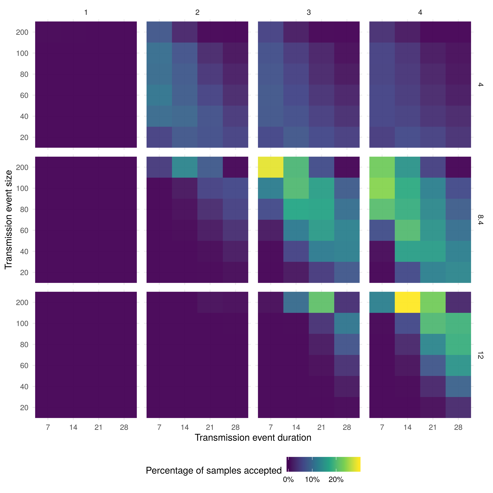

Authors (*needs updating to correct names*)
-------------------------------------------

S. Abbott1\*, J. Munday1, J.
Hellewell1&lt;/sup, J. Edmunds1&lt;/sup, S. Funk1</sup

*Correspondence to: sam.abbott@lshtm.ac.uk

## Affiliations (*needs full affiliations*)

1. London School of Hygiene and Tropical Medicine

## Introduction

The ongoing pneumonia outbreak appears to have originated from an animal-to-human transmission event at Huanan seafood wholesale market in Wuhan, China which was closed on the 31st of December 2019 [@Imai:webreport;  @Thompson:2020bc]. As of the 26th of January 2020 there are over 2000 confirmed case with the majority in China [@bbc:wuhan:report]. Globally, countries are on high alert with wide implementation of airport checks and contact tracing. In China, officials have restricted travel aross a wide area. There is still uncertainty around the precise scale and duration of the initial transmission (seeding) event. This has implications for the likely transmissibility of the infectious agent responsible for the outbreak and as such it is important that these potential scenarios are explored and their likelihood quantified. 

We used a stochastic branching process model - parameterised with available data where possible and otherwise informed by the 2002-2003 SARS outbreak - to simulate the Wuhan outbreak. We considered a range of parameters where data was not available, quantifying how likely these scenarios were to occur using reported cases (with reporting uncertainty). We focussed on the size and duration of the animal-to-human crossover event in particular, and the impact this has on the estimated level of human-to-human transmission. We aimed to provide decision makers, and researchers, with probability estimates for each scenario considered, along with estimates of the reproduction number (including uncertainty) across all scenarios.

## Methods

**Branching process model**

We modelled the outbreak using a stochastic branching process. We assumed that cases from the initial seeding event were uniformly distributed over the duration of the seeding event. Each case then resulted in a subsequent generation of cases with the number that each case generated being drawn from a negative binomial distribution - to account for overdisperion -  with a dispersion of 0.16 (assuming SARs like dispersion)[@Lipsitch:2003]. The mean number of cases generated by each case (the reproduction number) was sampled from a uniform distribution once per model simulation with a lower bound of 0 and an upper bound determined by the scenario being evaluated. Generations were then sampled iteratively until the maximum simulation time was reached. The serial interval between each generation was assumed to be normal with a mean varied during the scenario analysis and a standard deviation of 3.8 (assuming a SARS like distribution) [@Lipsitch:2003]. After the simulation of the branching process reporting delay was added to each case. The reporting delay was sampled from either a normal, a poisson, or a negative binomial distribution. This was determined by fitting these distributions to the compiled linelist of cases in China (*reference needed*) and selecting the best fit using the Chi-squared statistic. If no good fit was determined - using an arbitary thresold of 0.05 - then the reporting delay was instead sampled from the reported delays in the linelist.
   
**Scenario analysis**

We simulated the branching process model 10,000 times for all combinations of the following parameters: seeding event size (20, 40, 60, 80, 200), seeding event duration (7 days, 14 days, 21 days, and 28 days), the mean of the serial interval (4 days, 8.4 days [@Lipsitch:2003], 12)), and the upper bound of the reproduction number (1, 2, 3, 4). Parameter values used in the scenario analysis were either assumptions based on the current knowledge of the Wuhan outbreak or based on those used previously for SARs[@Lipsitch:2003]. We ran the model from the beginning of the outbreak for each scenario until the 25th of January 2020. The start date was determined by combining the duration of the seeding event with the date the fish market in Wuhan - the source of the outbreak - closed (31st of December 2019). Outbreak simulation was stopped if a sample exceeded 5000 cases by the end of simulation period.

**Conditioning on available case numbers**

We evaluated each scenario sample based on the cases observed on the 3rd of January (41 observed cases with an assumed upper bound of 400 cases), the 18th of Janurary (200 cases with an assumed upper bound of 2000 cases), and the 25th of January (1975 cases with an assumed upper bound of 5000 cases). Samples were rejected if their simulated cumulative cases were not consistent with these data. Uncertainty in the observed number of cases was assumed to be 10 times the number of observed cases for the 3rd and 18th of January and the number of observed plus the number of potential cases reported on the 25th of January. 

**Analysis**

We compared the percentage of samples that were accepted stratified by the seeding event size and seeding event duration for every combination of upper reproduction number bounds and mean serial intervals. We then used heatmaps to identify which scenarios were more likely to represent the underlying outbreak. We then reported the median, maximum, and minimum reproduction numbers of samples accepted after conditioning on the observed data, stratified by the seeding event size, seeding event duration and the assumed mean serial interval.

**Implementatation**

All analysis was carried out using R version 3.6.2 [@R]. The branching process model was implemented using the `bpmodels` package [@bpmodels]. The analysis is available as an open-source R package (*need reference - zenodo doi*). A dockerfile has been made available with the code to ensure reproducibility [@Boettiger:2015dw]. All analysis was run on a 16 core 4Ghz machine.

## Results

**Percentage of accepted outbreak simulation**

**Estimated reproduction number**

|Seeding event size vs. Seeding event duration |7               |14            |28              |
|:---------------------------------------------|:---------------|:-------------|:---------------|
|20                                            |3.6 (3.3 - 3.8) |3.5 (2 - 4)   |3.1 (1.6 - 4)   |
|40                                            |3.5 (2.7 - 4)   |3.3 (2.1 - 4) |2.6 (1.4 - 4)   |
|60                                            |3.4 (2.3 - 4)   |3.1 (1.8 - 4) |2.3 (1.6 - 4)   |
|80                                            |3.3 (2.1 - 4)   |2.8 (1.9 - 4) |2.1 (1.5 - 3.4) |
|100                                           |3.1 (2.1 - 4)   |2.6 (1.7 - 4) |2 (1.5 - 3.1)   |
|200                                           |2.4 (1.6 - 3.8) |2 (1.3 - 2.9) |1.7 (1.6 - 2.1) |

|Seeding event size vs. Seeding event duration |7             |14            |28              |
|:---------------------------------------------|:-------------|:-------------|:---------------|
|20                                            |-             |-             |3.6 (2.4 - 4)   |
|40                                            |-             |3.9 (3.8 - 4) |3.6 (2.3 - 4)   |
|60                                            |-             |3.8 (3.3 - 4) |3.4 (2.2 - 4)   |
|80                                            |-             |3.8 (3 - 4)   |3.3 (1.9 - 4)   |
|100                                           |3.9 (3.8 - 4) |3.7 (2.7 - 4) |3.1 (1.7 - 4)   |
|200                                           |3.7 (2.5 - 4) |3.3 (2.1 - 4) |2.4 (1.7 - 3.3) |

## Discussion

In this study we explored a range of scenarios for the initial event size and duration of the animal-to-human crossover event which initiated the 2019-20 Wuhan coronavirus outbreak. We conditioned on observed cases to establish the probability of each scenario, given our model, and then estimated the reproduction number of coronavirus virus. We found that there was a very low probability that the reproduction number was less than 1 for any scenario considered. *Add more as results become available*

Our study used a stochastic model to capture the transmission dynamics of the outbreak with parameters informed from data were possible or assumed to be similar to those estimated for SARs [@Lipsitch:2003]. As the outbreak progresses direct simulation may become too computationally demanding to be practical so other approaches may be required. More data is likely to become available, in particular disease specific estimates for the serial interval, during the course of the outbreak. This will make it possible to estimate the reproduction number with greater precision with less risk of bias due to unknown paramters. The number of scenarios that need to be evaluated will also be reduced as additional information about cases connected to the initial animal-to-human crossover event becomes available. Though our estimates had wide credible intervals it is possible that we could not fully account for the numerous sources of bias and uncertainty present in the available data. This means that our model estimates may be both spuriously precise and potentially biased. However, until more is known about the outbreak this cannot be easily assessed. However, we made use of a highly reproducible framework (an R package) and have released all of our code as open-source. This means that this analysis may be repeated - both by the authors and others - as more data becomes available. In addition, subject area experts may be able to adapt our analysis using this open-source code to reduce the potential for bias using their expert knowledge. 

As the outbreak progress more data will become available on the number of cases, and the duration of the serial interval. These data are likely to improve our estimates of the reproduction number and also alter the likelihood of certain scenarios. Additional data may also lead to a reevaluation of the suitability of the negative binomial distribution for generating new cases - or at least provide an outbreak specific estimate of the dispersion. Our analysis did not include interventions, such as case isolation, doing so may improve our estimates. The R package we have developed alongside our analysis may be generalisable to other point source outbreaks. Additional work is needed to ensure the robustness of this tool but this may allow this analysis to be repeated during future outbreaks with little additional overhead.

This analysis use a stochastic branching process to explore scenarios around the duration and size of the initial animal-to-human crossover event at the Huanan seafood wholesale market in Wuhan. Despite the scarcity of data currently available our estimates may be used to rule out some scenarios and to assess the likelihood of others. Our results indicate that it is very unlikely that the infectious agent responsible for the Wuhan outbreak has a reproduction number of less than 1, unless the size of the seeding event was much greater than currently reported. As more information becomes available it may also be possible to further refine our results and establish the reproduction number of the outbreak more firmly. Providing clear quantitive information for decision makers on the transmissibility of the infectious agent is of clear public health importance during outbreaks. Our work to make this process reproducible may reduce the time these estimates take to be made available in future outbreaks.  

**Contributors**

All authors conceived and designed the work. SA undertook the analysis with advice from all other authors. SF developed the branching process model. SA wrote the first draft of the paper and all authors contributed to subsequent drafts. *placeholder* reviewed the analysis code. All authors approve the work for publication and agree to be accountable for the work.

**Funding**

*Need funding statement*

**Competing interests**

There are no competing interests. 

**Accessibility of data and programming code**

The code for this analysis, interim results, and final results can be found at: *need zenodo DOI link*

## References

